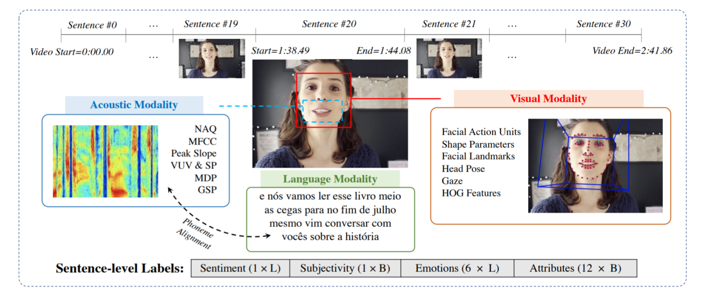
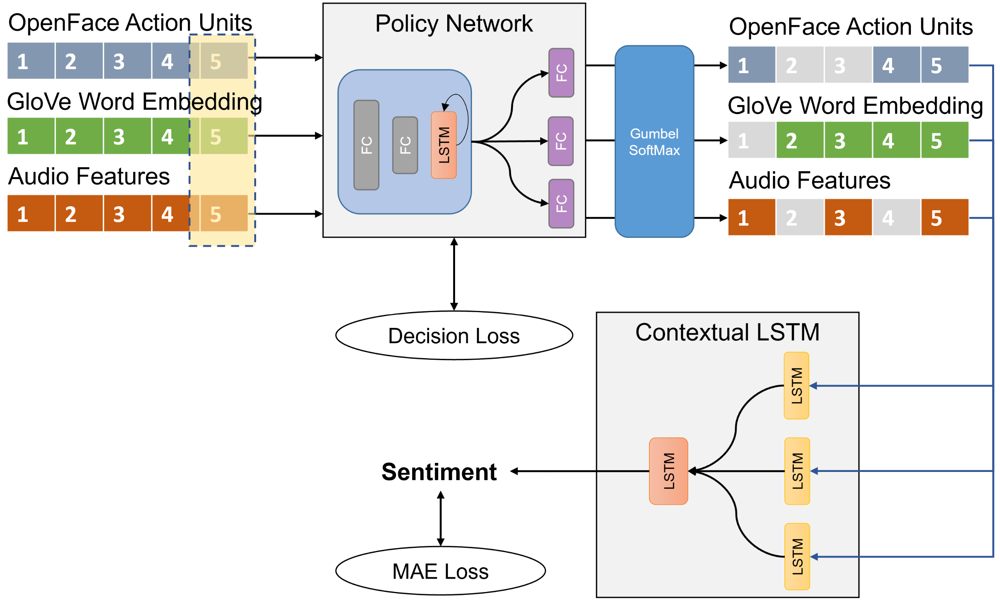
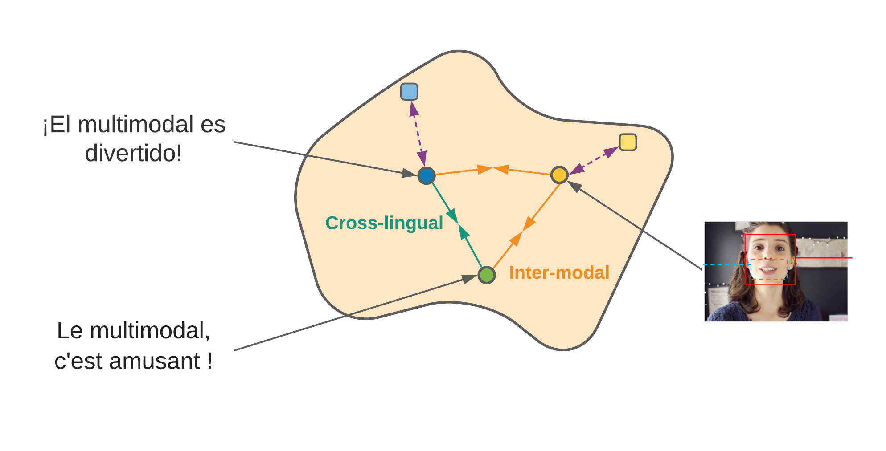

# 11777-Project: Multimodal Multilingual Sentiment Analysis

## Abstract

Multimodal sentiment analysis, incorporating information from visual, acoustic and textual modalities to detect sentiment, is a well-established research question. However, very few work has been done with languages other than English, partly because there was no multilingual sentiment analysis dataset available, and low-resource languages are diverse enough such that pre-trained models on English dataset face challenges when transfered to languages from very different roots or cultures.

With the release of CMU-MOSEAS dataset [[1]](#1), which contains sentiment labels for video clips in four European languages, we propose to build a multilingual multimodal sentiment detection model. Specifically, we generate cross-linguistic paired texts by means of translation and adopt Noise Contrastive Estimation (NCE) objective to aid learning robust multilingual multimodal representations. We also explore Adaptive MML that filters out non-representative modalities in the flow for efficient and robust sentiment analysis.

## Dataset

We primarily work with the CMU Multimodal Opinion Sentiment, Emotions and Attributions dataset (CMU-MOSEAS) [[1]](#1). It provides monologue recordings of synchronous visual, audio and transcript information in four different European languages (French, Spanish, Portuguese and German).

## Approach 1: Few-Shot Transfer Learning: AdaMML [[2]](#2) with Contextual LSTM [[3]](#3)
Our goal is to use a much smaller subset of Spanish training data together with full French training data to reach similar level of model accuracy as compared to learning from the full Spanish training set. We also employ an adaptive policy to select relevant modalities for prediction.
<!--  -->

## Approach 2: Noise Contrastive Estimation Objective with Translation Augmentation

Inspired by the work in Huang et al., 2021 [[4]](#4), we aim to learn a coordinated, multilingual multimodal embedding space that facilitates the downstream sentiment analysis task. We augment the dataset by translating video transcrips, such that one video corresponds to transcripts in two languages. We employ two NCE objectives: cross-lingual and inter-modal loss. The cross-lingual loss is based on the intuition that conditioned on a video, multilingual transcripts (translated pairs in our case) should be semantically similar. The inter-modal loss, on the other hand, enforces the similarity of paired video and transcript.

We use Multilogue-Net [[5](#5)] as our testbed and experiment with different contrastive objectives.

<!--  -->

For more details about baseline models, approaches and results, please refer to our report [here](./report.pdf).

## References
<a id="1">[1]</a> 
A. Bagher Zadeh, Y. Cao, S. Hessner, P. P. Liang, S. Poria, and L.-P. Morency, *CMU-MOSEAS: A multimodal language dataset for Spanish, Portuguese, German and French*, in Proceedings of the 2020 Conference on Empirical Methods inNatural Language Processing (EMNLP), Online, Nov. 2020, Association for Computational Linguistics, pp. 1801–1812.

<a id="2">[2]</a>
R. Panda, C.-F. Chen, Q. Fan, X. Sun, K. Saenko, A. Oliva, and R. Feris, *AdaMML: Adaptive Multi-Modal Learning for Efficient Video Recognition*, in International Conference on Computer Vision (ICCV), 2021.

<a id="3">[3]</a>
S. Poria, E. Cambria, D. Hazarika, N. Majumder, A. Zadeh, and L.-P. Morency, *Context-dependent sentiment analysis inuser-generated videos*, in Proceedings of the 55th Annual Meeting of the Association for Computational Linguistics (Volume 1: Long Papers), Vancouver, Canada, July 2017, Association for Computational Linguistics, pp. 873–883.

<a id="4">[4]</a>
P. Huang, M. Patrick, J. Hu, G. Neubig, F. Metze, and A. G. Hauptmann, *Multilingual multimodal pre-training for zero-shot cross-lingual transfer of vision-language models*, CoRR, abs/2103.08849 (2021).

<a id="5">[5]</a>
Shenoy, A. and Sardana, A. *Multilogue-net: Acontext-aware RNN for multi-modal emotion detection and sentiment analysis in conversation*. In Second Grand-Challenge and Workshopon Multi-modal  Language (Challenge-HML), pp. 19–28, Seattle, USA, July 2020. Association for Computational Linguistics. 

